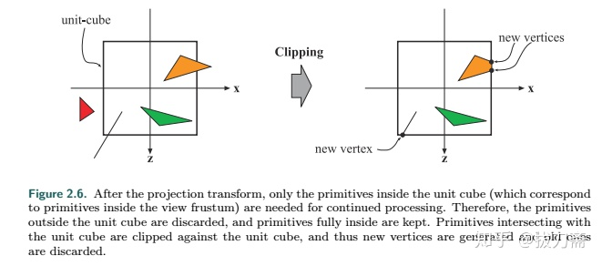

```
gl_PointCoord 左上角为原点，范围[0,1]

out float gl_FragDepth;

它是要被写入到深度缓冲区的值。也将被用于深度测试。片断着色器不一定要指定它的值。它可能被gl_FragCoord.z.自动填充。需要注意的是：如果在某处指定，在其他地方也必须要进行指定。


gl_FragCoord.w is 1 / clip.w, where clip.w is the W component of the clip-space position (ie: what you wrote to gl_Position).

gl_FragCoord.z is generated by the following process, assuming the usual transforms:

Camera-space to clip-space transform, via projection matrix multiplication in the vertex shader. clip.z = (projectionMatrix * cameraPosition).z
Transform to normalized device coordinates. ndc.z = clip.z / clip.w
Transform to window coordinates, using the glDepthRange near/far values. win.z = ((dfar-dnear)/2) * ndc.z + (dfar+dnear)/2.

Now, using the default depth range of near=0, far=1, we can define win.z in terms of clip-space: (clip.z/clip.w)/2 + 0.5. If we then divide this by gl_FragCoord.w, that is the equivalent of multiplying by clip.w, thus giving us:

(gl_FragCoord.z / gl_FragCoord.w) = clip.z/2 + clip.w/2 = (clip.z + clip.w) / 2
Using the standard projection matrix, clip.z represents a scale and offset from camera-space Z component. The scale and offset are defined by the camera's near/far depth values. clip.w is, again in the standard projection matrix, just the negation of the camera-space Z. Therefore, we can redefine our equation in those terms:

(gl_FragCoord.z / gl_FragCoord.w) = (A * cam.z + B -cam.z)/2 = (C * cam.z + D)
Where A and B represent the offset and scale based on near/far, and C = (A - 1)/2 and D = B / 2.

Therefore, gl_FragCoord.z / gl_FragCoord.w is not the camera-space (or world-space) distance to the camera. Nor is it the camera-space planar distance to the camera. But it is a linear transform of the camera-space depth. You could use it as a way to compare two depth values together, if they came from the same projection matrix and so forth.

To actually compute the camera-space Z, you need to either pass the camera near/far from your matrix (OpenGL already gives you the range near/far) and compute those A and B values from them, or you need to use the inverse of the projection matrix. Alternatively, you could just use the projection matrix directly yourself, since fragment shaders can use the same uniforms available to vertex shaders. You can pick the A and B terms directly from that matrix. A = projectionMatrix[2][2], and B = projectionMatrix[3][2].

shareimprove this answer

answered Dec 5 '12 at 20:10

community wiki
```

[参考](https://blog.csdn.net/fatcat123/article/details/83588778)


只存在于webgl1中，webgl2默认有这个功能，但是要求GLSL #version 300es

gl_FragDepth 存在于webgl2，且GLSL #version 300es

gl_FragDepthEXT 存在于webgl1，

##EXT_color_buffer_float##
只存在于webgl2，
##WEBGL_color_buffer_float##
只存在webgl1

##EXT_color_buffer_half_float##
存在于webgl1和webgl2

图元装配：将顶点装配成图元（执行裁剪、透视分割和Viewport变换操作。）将顶点着色器的输出值执行裁剪、透视分割、视口变换后进入光栅化阶段。
裁剪：[视图空间外的图元全部裁剪掉，视图内的保留，部分在视图内的图元通过裁剪和生成新的顶点的方式保留视图内的部分](https://zhuanlan.zhihu.com/p/297667335)；

模型变换（顶点着色器阶段处理）
视图变换（顶点着色器阶段处理）
模型视图变换（顶点着色器阶段处理）
投影变换（顶点着色器阶段处理）
透视除法（图元装配阶段处理）
视口变换（图元装配阶段处理）

顶点着色器->图元装配->光栅器->片段着色器->逐片段操作（裁剪测试，多重采样操作，背面剔除，模板测试，深度测试，融合，缓存）

http://www.yanhuangxueyuan.com/webgl_course/hardware.html