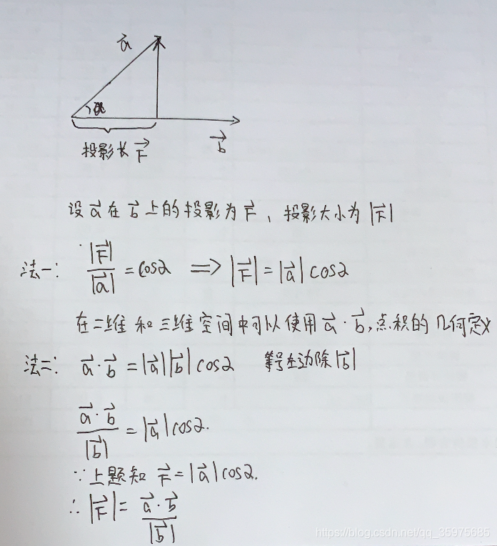

当相机的三个坐标轴不相互垂直的时候就需要进行直角归一化



```javascript

/*
    投影长度计算：|F| = (a · b) / |b|
    投影向量为：F =  |F| * b / |b|
    推导过程：https://blog.csdn.net/qq_35975685/article/details/91152718
*/
const b = new Vector3(0, 0, 1);
const a = new Vector3(0, 1, 20);
const inva = 1.0 / a.lengthSq();
const scalar = a.dot(b) * inva;

const w0 = b.clone().multiplyScalar(scalar);
a.sub(w0).normalize()
```
